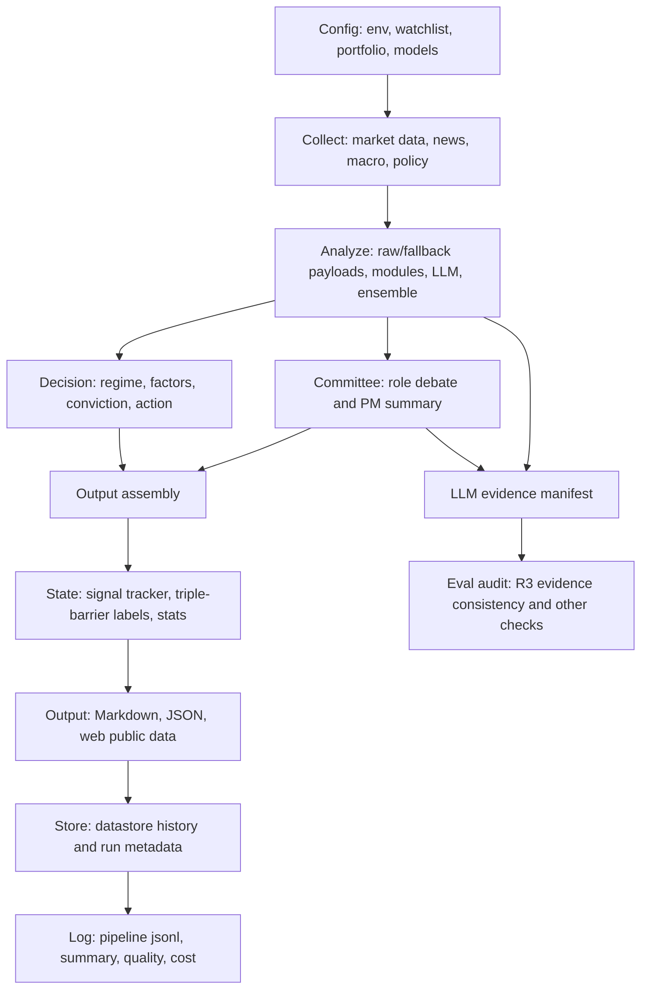

# Architecture

## Codex Routing

- Read first when the task is about system shape, layer boundaries, or deciding which layer doc to open.
- For runtime sequencing, pair with `docs/pipeline.md` and `docs/pipeline-runtime.md`.
- For cross-layer handoff rules, pair with `docs/pipeline-boundaries.md`.
- For decision logic, go to `docs/decision.md`.
- For shared helper behavior, go to `docs/utils.md`.

## System Purpose

This repository is a batch stock research automation system.

The production path collects normalized market, news, macro, policy, and portfolio context; analyzes the watchlist with deterministic modules and cost-aware LLM calls; generates rule-based decisions; updates state; writes Markdown and JSON artifacts; persists history; and logs operational quality.

Non-goals:

- No real-time trading system
- No trading automation or order execution
- No complex infrastructure beyond the batch pipeline, local datastore, GitHub Actions, and static web outputs
- No direct external fetching outside the collector layer

## Core Invariant

The pipeline invariant is:

```text
collect -> analyze -> state -> output -> store -> log
```

Primary entrypoint:

- `src/pipeline.py::run_pipeline()`

Secondary entrypoints:

- `src/pipeline.py::collect_only()` for intraday price refresh without the full analysis path
- `src.cli.run_sectors` for sector explorer payload generation
- `src.eval.runner` for LLM audit checks and reports

## High-Level Flow



## Layer Responsibilities

### Collector

Source area:

- `src/collector/`

Responsibilities:

- Fetch external market, news, macro, policy, and event data.
- Own provider fallback chains and throttling behavior.
- Normalize collected data before handing it to analyzer.
- Detect the effective market date from collected price history.
- Backfill missing prices from datastore history when collector data has gaps.
- Prepare peer candidates and macro inputs used downstream.

Current provider families include market data, news, SEC/IR sources, macro events, and policy dossiers. External APIs belong here; downstream layers must consume normalized inputs only.

### Analyzer

Source area:

- `src/analyzer/`

Responsibilities:

- Build raw payloads and schema-safe fallback payloads per ticker.
- Resolve module order with `ModuleRegistry`.
- Run deterministic modules before LLM modules.
- Run structured LLM modules with strict JSON schemas.
- Validate LLM output with hallucination, grounding, and signal shape guards.
- Run cost-aware ensemble analysis.
- Record BudgetGuard shadow decisions before optional deep LLM paths.
- Produce macro narrative and per-ticker macro sensitivity.
- Emit best-effort LLM evidence manifests before provider calls.

Core components:

- `AnalysisOrchestrator`
- `AnalysisEnsemble`
- `src/analyzer/modules/*`
- `src/analyzer/prompts/*`
- `src/analyzer/validator.py`
- `src/analyzer/signal_levels.py`
- `src/analyzer/evidence_manifest.py`

Current LLM module families:

- News analysis
- Research narrative
- Risk assessment
- Signal takeaway
- Macro narrative
- Weekly insight
- Policy impact mapping
- Committee role review

Analyzer constraints:

- No direct external data fetching
- No final presentation formatting
- No persistence except explicit evidence-manifest operational writes
- Fallbacks must preserve downstream payload shape
- Committee and LLM output must not replace rule-based official decisions

### Ensemble

Source area:

- `src/analyzer/ensemble.py`
- `config/models.yaml`

Flow:

- Economy profile analyzes the full watchlist.
- Selected tickers receive deep LLM-only re-analysis.
- Optional third review can run when economy and deep disagree.
- Final analysis source priority is `third_review > deep > economy`.

Routing is cost-aware. The monthly budget is protected by model profiles, module-specific overrides, batch sizes, and selective deep passes.

BudgetGuard currently wraps ensemble deep and tie-break routes in shadow mode. A shadow decision records whether the route would exceed the configured daily cap, but default execution still continues.

### Committee

Source area:

- `src/analyzer/committee.py`
- `src/analyzer/committee_prompt.py`

Responsibilities:

- Run role-based review after ensemble analysis.
- Roles include growth analyst, value skeptic, risk manager, macro strategist, and PM.
- Run shallow/economy committee coverage across tickers.
- Trigger selective deep review for risk, macro, and PM when confidence or objections require it.
- Store committee output on `TickerAnalysis.committee_analysis` for downstream presentation.

Committee output is a debate and review surface. It is not the source of truth for official `buy`, `watch`, or `avoid`.

BudgetGuard currently wraps committee deep review in shadow mode. The economy committee pass remains the broad default; deep review telemetry is logged before escalated risk, macro, and PM calls.

### Decision

Source area:

- `src/decision/`

Responsibilities:

- Classify market regime and sub-regime.
- Run registered decision factors.
- Score conviction and generate official actions.
- Surface `factor_reasoning` for output consumers.
- Compute final `data_quality_score` metadata from analyzer validation, collector freshness, coverage, source diversity, fallback depth, fundamentals, and macro context.

Decision output owns:

- `TickerDecision.action`
- `TickerDecision.conviction`
- `TickerDecision.raw_conviction`
- `TickerDecision.factor_reasoning`
- `TickerDecision.confidence_meta.data_quality_score`
- `TickerDecision.confidence_meta.data_quality_gate`
- `TickerDecision.confidence_meta.search_evidence_score`
- `TickerDecision.confidence_meta.search_quality_gate`

Decision logic is rule-based even when upstream analysis uses LLMs.

The data-quality gate is shadow-only by default. It records whether low quality would cap a `buy` to `watch`, and `DECISION_DATA_QUALITY_GATE_MODE=enforce` can promote that cap into official action behavior.

The search-quality gate is also shadow-only by default. The pipeline collects normalized search evidence, generates official decisions, then attaches search evidence score and gate metadata before state/output serialization. `DECISION_SEARCH_QUALITY_GATE_MODE=enforce` can cap a weak-evidence `buy` to `watch`; missing search payloads remain unavailable metadata and do not cap official actions.

### State

Source areas:

- `src/utils/signal_tracker.py`
- datastore-backed utilities

Responsibilities:

- Update signal history.
- Apply triple-barrier signal labeling.
- Recompute signal statistics used by decision and output layers.
- Keep state reproducible from stored inputs and prior outputs.

State must not depend on external APIs.

### Output

Source area:

- `src/output/`

Responsibilities:

- Write deterministic Markdown artifacts.
- Write stable JSON payloads for web and analytics.
- Write operational reports such as API status, quality, cost, routing, and audit outputs.
- Sync selected payloads into `web/public/output/data/` and `web/dist/output/data/` when the static web app is present.

Primary artifact families:

- `output/daily/YYYY-MM-DD.md`
- `output/daily/weekly/YYYY-Www.md`
- `output/tickers/<TICKER>/YYYY-MM-DD.md`
- `output/data/index.json`
- `output/data/tickers/<TICKER>/latest.json`
- `output/data/tickers/<TICKER>/history.json`
- `output/data/api_status.json`
- `output/data/analysis_quality.json`
- `output/data/cost_log.json`
- `output/data/routing_outcome.json`
- `output/data/llm_evidence/<DATE>.jsonl`
- `output/data/llm_audit/<DATE>.json`
- `docs/reports/llm-audit-YYYY-MM-DD.md`

Output constraints:

- No data fetching
- No LLM calls
- No decision recomputation
- Formatting consumes finalized data only
- Schema changes should be additive unless a migration is documented

### Datastore

Source area:

- `src/utils/datastore.py`

Responsibilities:

- Provide the single persistence boundary.
- Persist price history and analysis run metadata.
- Support CSV and SQLite backends.
- Serve historical prices and signal statistics to state and decision code.

No layer should bypass datastore for persisted history.

### Logging And Observability

Source areas:

- `src/utils/pipeline_logging.py`
- output writers for operational payloads

Responsibilities:

- Record per-run JSONL events.
- Produce per-run summary JSON.
- Derive API status, analysis quality, validation warning, and cost reports.
- Keep logging best-effort unless the primary pipeline has already failed.

Primary log artifacts:

- `logs/pipeline/YYYY-MM-DD.jsonl`
- `logs/pipeline/YYYY-MM-DD.summary.json`

### Eval Audit

Source area:

- `src/eval/`

Responsibilities:

- Load audit windows from output, logs, and evidence manifests.
- Run replay and non-replay checks.
- Render Markdown and JSON audit reports.

Current check families include schema stability, missingness, format consistency, input size drift, numeric grounding, citation integrity, language consistency, contradiction checks, semantic drift, committee agreement, retry distribution, pipeline summary, and evidence consistency.

R3 evidence consistency reads:

- `output/data/llm_evidence/<DATE>.jsonl`

R3 verifies that comparable economy, deep, tie-break, and committee records share consistent source evidence hashes. Missing legacy manifests report `info`; hash mismatches fail; non-critical missing linkage can warn.

## Data Contracts

### Collected Input

Collector output is normalized into `CollectedTickerData` and related typed records from `src/types.py`.

Important input groups:

- Price and technical data
- Fundamentals and valuation fields
- News references
- Upcoming events
- Options and positioning
- Macro context and market regime
- Policy events and ticker impact candidates
- Portfolio holdings and risk inputs

### Analysis Payload

Analyzer payloads are split into:

- Raw payloads: normalized collector data for LLM and deterministic modules
- Fallback payloads: schema-safe defaults per ticker
- Intermediate results: module outputs merged by ticker
- Portfolio-level results: shared outputs such as portfolio risk

### Final Ticker Output

Final per-ticker payloads include:

- Summary and key news
- News references and citation indices
- Financial highlights
- Risk/watchpoints
- Signal takeaway
- Trade frame
- Macro sensitivity
- Committee analysis
- Official decision and factor reasoning

## LLM Evidence Manifest

The analyzer emits evidence manifests immediately before LLM calls.

Path:

```text
output/data/llm_evidence/<run_date>.jsonl
```

Records contain hashes and metadata only. They must not contain raw prompts, full payloads, model responses, API keys, or sensitive environment values.

Current evidence scopes:

- `ticker`
- `run`
- `committee_role`
- `policy_chunk`
- `weekly`

Common metadata includes:

- `run_date`
- `stage`
- `scope`
- `module`
- `ticker` when applicable
- `model`
- `model_profile`
- `prompt_version`
- evidence hashes such as raw payload, fallback payload, macro context, market regime, prompt template, and role payload hashes

Manifest writes are best-effort. Failure to write evidence should emit a warning but must not fail the daily pipeline.

## Web Surface

Source area:

- `web/`

The web app is a static consumer of output artifacts. It does not own pipeline logic.

Consumption path:

```text
output/data/* -> web/public/output/data/* -> dashboard UI
```

The web UI reads finalized JSON payloads such as `index.json`, ticker histories, sector payloads, API status, quality reports, cost logs, committee analysis, and PM review payloads.

Web constraints:

- No recomputation of official decisions
- No hidden analysis logic
- No direct provider calls
- UI may present committee and PM review data, but official actions remain from the decision layer

## Configuration

Primary config files:

- `config/watchlist.yaml`
- `config/models.yaml`
- portfolio input files under config or state paths used by the pipeline

Model config owns:

- Default profile
- Per-module profile overrides
- Batch-size overrides
- Ensemble routing
- Committee model routing
- Cost estimates
- BudgetGuard shadow/enforce settings for guarded optional LLM paths

Configuration changes that affect cost or model behavior should include a rationale.

## Operational Modes

Daily full run:

- Runs collect, analyze, decision, state, output, store, and log.

Intraday refresh:

- Uses `collect_only()` for price refresh without full LLM analysis.

Audit run:

- Uses `src.eval.runner` to inspect existing outputs/logs/evidence and write audit reports.

Sector explorer:

- Uses `src.cli.run_sectors` to generate sector-facing payloads and sync web-public data.

Shadow or migration modes:

- Controlled by feature flags.
- Shadow mode can compare implementations.
- Primary mode decides the source of truth.
- Feature flags must not bypass boundaries.

## Boundary Rules

- Preserve `collect -> analyze -> state -> output -> store -> log`.
- Keep external API fetching inside collector.
- Keep LLM prompt, parsing, and validation inside analyzer.
- Keep official actions inside decision.
- Keep presentation formatting inside output and web.
- Keep persistence behind datastore.
- Keep logging observational and non-mutating.
- Never make GitHub Actions, Vercel builds, or web rendering the source of business logic.
- Keep optional features additive and non-destructive.

## Current Risk Areas

- OneDrive-hosted working trees can interfere with `.git` and frequent output writes.
- LLM validation warnings are expected but should trend down through prompt and validator improvements.
- Committee output is intentionally presentation-only; accidental coupling into official decisions should be avoided.
- Evidence manifests are operational artifacts and should remain hash-only.
- Output payloads are large and diff-heavy after full pipeline runs; schema changes need focused tests.

## Done Criteria For Architecture Changes

Architecture-affecting changes are complete only when:

- The pipeline invariant still holds.
- Layer ownership remains clear.
- Related layer docs are updated.
- Output schemas or audit contracts have tests when changed.
- Cost behavior is unchanged or explicitly justified.
- A focused verification command has passed.
