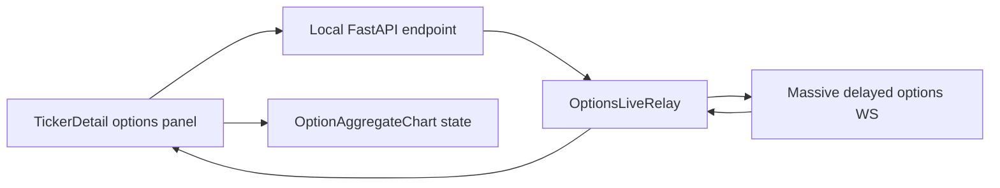
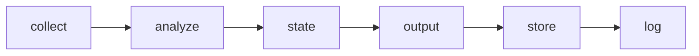

# Options Starter Live Panel Design

## Summary

Add an optional options-market live panel to the ticker detail page using the user's current Polygon/Massive Options Starter plan.

This is not a real-time underlying stock-price chart. Options Starter provides options-contract aggregate WebSocket access with 15-minute delayed data. The feature therefore shows a delayed options-contract second-aggregate chart and options diagnostics beside the existing ticker detail research view.

The approved direction is to keep the current plan and avoid new market-data spend:

- Use Options Starter capabilities.
- Keep the existing stock price chart and batch pipeline outputs unchanged.
- Add a clearly labeled `DELAYED 15m` options panel for selected contracts.
- Treat the feature as a local dashboard companion, not an official decision input.

## Source And Entitlement

Relevant official docs:

- `https://massive.com/docs/websocket/options/aggregates-per-second`
- `https://massive.com/docs/websocket/options/aggregates-per-minute`
- `https://massive.com/docs/websocket/options/trades`
- `https://massive.com/docs/websocket/options/quotes`
- `https://massive.com/docs/websocket/stocks/overview`

Observed entitlement split:

- Options second aggregates: `A.O:<contract>`, Options Starter supports 15-minute delayed data.
- Options minute aggregates: `AM.O:<contract>`, Options Starter supports 15-minute delayed data.
- Options trades: `T.O:<contract>`, not included in Options Starter.
- Options quotes: `Q.O:<contract>`, not included in Options Starter.
- Underlying stock WebSocket data is a separate stocks entitlement; true real-time stock charts are out of scope for this plan.

The implementation should connect to `wss://delayed.massive.com/options` for the Starter-compatible path. It must not attempt to use `wss://socket.massive.com/stocks` unless a future task explicitly adds a real-time stocks plan.

## Goals

- Let the user inspect options-market movement from the ticker detail page without increasing LLM usage.
- Show selected option-contract premium movement using second aggregates when a contract is active.
- Show available option diagnostics such as implied volatility and Greeks when available from existing Polygon REST snapshot support or a focused read-only endpoint.
- Keep all live/delayed market data out of the official `buy` / `watch` / `avoid` decision path.
- Avoid exposing API credentials to the browser.

## Non-Goals

- No live trading, order routing, account access, or portfolio mutation.
- No decision recomputation or factor-score changes from options stream data.
- No LLM calls.
- No persistence into `output/data` or `web/public/output/data`.
- No broad real-time infrastructure for the batch pipeline.
- No claim that Options Starter provides real-time underlying stock prices.

## Architecture

The feature is a small optional side channel outside the batch pipeline:

1. The React ticker detail page asks the local FastAPI app for option contracts and opens a local WebSocket relay when the panel is enabled.
2. The FastAPI relay authenticates to Polygon/Massive using server-side environment credentials.
3. The relay subscribes to one selected options aggregate channel, initially `A.O:<contract>`.
4. The browser receives normalized aggregate events from the local relay and updates only the panel chart state.
5. The panel renders status, selected contract metadata, the delayed second-aggregate chart, and available diagnostics.

This keeps the API key out of frontend bundles and keeps the static output artifacts as the source of truth for official research data.

## Backend Design

Add the streaming relay under the existing local FastAPI API service. Shared provider code may contain only credential handling, REST contract lookup, and message normalization helpers; it must not make the batch collector depend on a live WebSocket loop.

- `OptionsContractLookup`: read-only helper for contracts near the current ticker.
- `OptionsLiveRelay`: WebSocket client/relay that connects to Massive delayed options WebSocket.
- `OptionsAggregateNormalizer`: validates and converts provider messages into a compact frontend event.

Suggested local API surface:

```text
GET /api/options/contracts?ticker=AAPL
WS  /api/options/live?contract=O:AAPL260116C00200000&timespan=second
```

The contract lookup should be lightweight and defensive. The first implementation should:

- return a capped list of near-term option contracts for the current underlying ticker;
- prefer strikes near the latest known underlying price from existing static outputs when available;
- include both calls and puts when the provider response allows it;
- keep a manual contract input fallback so the panel remains useful if contract lookup is unavailable.

The relay should allow only one selected contract per browser connection in the first implementation. Wildcard subscriptions such as `A.*` must not be used because options markets are high-volume and unnecessary for this dashboard.

Credentials should use the existing Polygon key if the project already standardizes on it, with a `MASSIVE_API_KEY` alias accepted only if implementation context shows that is useful. Missing credentials should return an unavailable status instead of crashing the local API.

IV and Greeks should come from a focused read-only snapshot/contract endpoint, not from the second-aggregate stream. The UI can refresh those diagnostics on a modest interval while the panel is open, and it must label them independently if their provider recency differs from the aggregate chart.

## Frontend Design

Add an options panel to `TickerDetail` near the existing price chart area.

The panel should include:

- a compact contract selector or manual contract input;
- a clear status badge: `DELAYED 15m`, `CONNECTING`, `DISCONNECTED`, `NO KEY`, or `NO ACCESS`;
- a chart of the selected option contract's second aggregates;
- compact fields for last price, open/high/low/close, volume, VWAP, and accumulated volume when present;
- optional IV/Greeks fields when available from the snapshot path;
- an empty state explaining that no contract is selected.

The existing `PriceChart` can be reused only if its props can accept option aggregate rows without weakening stock-chart semantics. If that causes ambiguity, create a small `OptionAggregateChart` wrapper that uses the same chart library but labels units and status specifically for option contracts.

The panel must not use visible text to over-explain basic UI mechanics. Status and labels should do the work. The most important visible distinction is that this is an options contract panel and is delayed by 15 minutes.

## Data Contract

The relay emits normalized messages shaped for UI rendering:

```json
{
  "type": "aggregate",
  "source": "polygon_options",
  "recency": "delayed_15m",
  "channel": "A",
  "contract": "O:AAPL260116C00200000",
  "timestamp": 1780617600000,
  "open": 3.1,
  "high": 3.15,
  "low": 3.05,
  "close": 3.12,
  "volume": 42,
  "accumulated_volume": 1204,
  "vwap": 3.11
}
```

Status messages use a separate shape:

```json
{
  "type": "status",
  "status": "connected",
  "recency": "delayed_15m",
  "message": "subscribed"
}
```

Error statuses should be typed and display-safe:

- `missing_credentials`
- `provider_auth_failed`
- `provider_no_access`
- `invalid_contract`
- `provider_disconnected`
- `rate_limited`

The frontend should display these as panel state only. It must not write them to official JSON output artifacts.

## Data Flow



The batch pipeline remains unchanged:



The options panel does not feed into this pipeline.

## Error Handling

- Missing API key: panel shows `NO KEY`; backend returns a typed status.
- Entitlement denied: panel shows `NO ACCESS`; backend closes the relay cleanly.
- Invalid contract: panel shows an invalid-contract state and keeps the rest of the ticker page usable.
- Provider disconnect: relay retries with bounded backoff while the frontend shows `DISCONNECTED` or `CONNECTING`.
- No aggregate events: chart remains in an empty state and keeps the latest status visible.
- Market closed: no special inference is needed; the absence of events plus delayed status is sufficient.

All failures are local UI/provider failures and must not fail the batch research pipeline.

## Cost And Token Impact

The feature should reduce pressure to ask the LLM for fresh price/market color because the options panel supplies structured market telemetry directly in the UI.

It adds no LLM calls and should not change monthly model cost. Provider calls remain credential-gated and user-initiated from the local dashboard.

## Implementation Boundaries

Allowed:

- FastAPI local endpoint or WebSocket route for options relay.
- A small provider adapter for Massive delayed options aggregate WebSocket.
- Contract lookup or manual contract selection.
- React hook for option aggregate stream state.
- Ticker detail panel and chart rendering.
- Tests for provider normalization, API status behavior, and frontend states.
- Documentation update explaining the optional delayed options panel.

Not allowed:

- Writing streamed values into `output/data` or mirrored web output.
- Recomputing official decisions from options stream data.
- Enabling wildcard option subscriptions.
- Calling trades or quotes channels on Options Starter.
- Exposing API keys in Vite environment variables or frontend JSON.
- Adding trading automation.

## Testing Plan

Backend:

- Normalizes a sample `A.O:<contract>` aggregate message.
- Rejects invalid contract strings.
- Emits `missing_credentials` when no key is configured.
- Maps provider auth/access errors to typed statuses.
- Keeps WebSocket disconnect handling bounded and non-crashing.

Frontend:

- Renders the options panel on ticker detail without breaking the existing price chart.
- Shows `DELAYED 15m` when connected to the Starter-compatible path.
- Shows `NO KEY`, `NO ACCESS`, and disconnected states.
- Appends or updates second-aggregate chart points without layout shift.
- Handles an empty contract selection.

Verification:

- Run focused Python tests for the relay/normalizer.
- Run focused React tests for the panel/hook.
- Run `python -m compileall main.py src tests`.
- Run `cd web && npm run build`.
- Use the in-app browser to verify the ticker detail panel at desktop and mobile widths if the local app can be started.

## Completion Criteria

The feature is complete when:

- The ticker detail page can show a selected options contract panel using Options Starter-compatible delayed aggregate data.
- The UI clearly labels the data as options-contract data and `DELAYED 15m`.
- Missing keys, missing access, bad contracts, and disconnects are handled without breaking the page.
- The existing stock price chart, official decisions, output artifacts, and batch pipeline remain unchanged.
- Tests and build pass.
