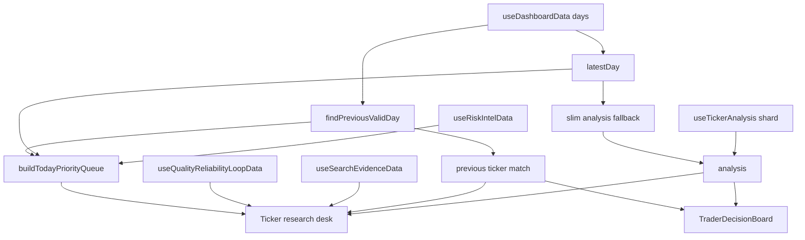
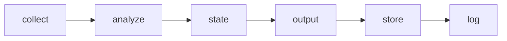

# Ticker Research Desk Design

## Summary

Improve the ticker detail page into a focused research desk. The page already has most of the needed data and components: ticker header, official decision card, today research brief, search evidence panel, trader decision board, price chart, options live panel, financial sections, filings, timeline, scenarios, and AI committee details.

The approved direction is option B from the site-improvement discussion:

- Make ticker detail the main place to understand one stock deeply.
- Keep existing data contracts and official decision logic unchanged.
- Reorganize the first screen around "what is the decision, why now, what evidence supports it, and what should be checked next."
- Use existing components where possible instead of adding a new broad feature surface.
- Connect existing available data into the trader decision board so important fields do not remain `N/A` when the page already has the inputs.

This is a frontend and presentation-layer improvement. It should not alter the batch pipeline, provider calls, official `buy` / `watch` / `avoid` decisions, or generated JSON schemas.

## Current Context

`web/src/pages/TickerDetail.tsx` currently renders the top of the page in this order:

1. back link
2. ticker header
3. `DecisionCard`
4. `TickerResearchBrief`
5. `SearchEvidencePanel`
6. `TraderDecisionBoard`
7. optional policy exposure card
8. detail tabs

The detail tabs are:

- `개요`
- `차트`
- `재무`
- `재료`
- `시나리오`
- `AI 위원회`

The chart tab already renders `PriceChart` and `OptionsLivePanel`. The options panel is presentation-only and must remain outside official decisions.

`TraderDecisionBoard` already accepts props for:

- `decision`
- `previousDecision`
- `upcomingEvents`
- `currentPrice`

The current `TickerDetail` call site does not pass those props. As a result, the board can miss conviction breakdown, previous-day change, event timeline, and price-based reevaluation triggers even when the page has the data.

`TickerResearchBrief` already uses the today priority queue context and previous-day context. It should remain the per-ticker "why this came up today" companion, not become a new official decision source.

## Goals

- Make the first screen of ticker detail answer four questions quickly:
  - What is the official action now?
  - What changed or why is this ticker worth reviewing today?
  - How reliable is the evidence and data quality?
  - What is the next concrete check?
- Reduce duplicated mental work between the top cards and lower tabs.
- Keep the page useful when a ticker is not in the today priority queue.
- Preserve the existing tab model so deep sections stay easy to navigate.
- Fill the existing trader decision board with already-available inputs.
- Improve mobile behavior by keeping the top research desk compact and stable.
- Keep the implementation local to ticker detail and nearby presentation components.

## Non-Goals

- No new LLM calls.
- No provider API changes.
- No new realtime stock-price entitlement or underlying stock WebSocket.
- No changes to generated output schemas.
- No official decision recomputation.
- No portfolio mutation.
- No trading automation.
- No broad redesign of dashboard, backtest, admin, or portfolio pages.
- No removal of the options live panel.

## Approved UX Direction

Create a compact "research desk" at the top of ticker detail. The desk should not be a marketing hero. It should feel like an operator workspace: dense, readable, and practical.

Recommended first-screen information order:

1. Ticker identity and price context.
2. Official decision and conviction.
3. Today research reason, when available.
4. Evidence/data-quality state.
5. Next check and reevaluation triggers.

The page should keep the existing tabs for deeper exploration:

- Chart: price chart, delayed options contract stream, price action metrics, positioning, options summary.
- Financials: earnings setup, valuation, peers, quarterly financials.
- Materials: news, filings, timeline.
- Scenario: sizing, bull/base/bear cases, signal validation history.
- AI Committee: committee details when available.

## Component Design

### TickerDetail

`TickerDetail` remains the route-level orchestrator. It should compute and pass existing data into child components:

- `currentDecision`: `analysis.decision`
- `previousTicker`: matched previous-day ticker from `previousDay`
- `previousDecision`: `previousTicker?.decision`
- `currentPrice`: `analysis.data_snapshot['Price']`
- `upcomingEvents`: `analysis.upcoming_events`
- `researchBriefItem`: current today queue item for the ticker

The existing `previousDay` lookup can be reused. No new data loading hook is needed.

### Research Desk Shell

Add a shallow presentation grouping near the top of `TickerDetail`. The first implementation should keep this grouping in `TickerDetail` instead of extracting a new component. Extraction to a focused `TickerResearchDesk` component is reserved for a later cleanup if the markup becomes hard to read.

The desk should contain:

- official action and conviction from the existing `DecisionCard`;
- today queue context from `TickerResearchBrief`;
- evidence state from the existing full `SearchEvidencePanel` directly below the grid;
- next check from `researchBriefItem.nextCheck`, `decision.valid_until`, or fallback copy;
- optional previous-day change when `previousDecision` exists.

The first implementation should use this concrete layout:

- a shallow two-column grid with `DecisionCard` on the left and `TickerResearchBrief` on the right;
- `SearchEvidencePanel` immediately below that grid as a top-level sibling, not nested inside another card;
- `TraderDecisionBoard` after the evidence panel, with the missing context props connected.

This avoids creating another decision card that duplicates `DecisionCard`. The important requirement is a single, obvious first-screen narrative. The user should not have to scan four unrelated cards to understand the ticker.

### TraderDecisionBoard

Update the `TickerDetail` call site to pass:

- `decision={analysis.decision}`
- `previousDecision={previousDecision}`
- `upcomingEvents={upcomingEvents}`
- `currentPrice={analysis.data_snapshot['Price']}`

This is the highest-value low-risk improvement. It uses existing board logic and existing data.

Expected effects:

- conviction breakdown appears when `decision.factors` exists;
- previous-day conviction delta appears when previous decision exists;
- event timeline appears from `upcomingEvents`;
- reevaluation trigger text uses current price, target, stop, and validity data where available.

### TickerResearchBrief

Keep the current component and Korean display labels. It should continue to handle:

- ticker included in today queue;
- ticker not included in today queue;
- risk/opportunity/evidence labels;
- reason chips and next check.

Possible light improvements during implementation:

- tighten the empty state so it reads as neutral context, not a missing feature;
- cap reason list length to three visible reasons if mobile visual QA shows the brief growing too tall;
- keep long labels wrapping without layout overflow.

### SearchEvidencePanel

Keep the panel read-only. It should remain based on `decision.confidence_meta` and search-evidence summaries already available to the frontend.

The first implementation should keep it as a full top-level panel directly below the decision-and-brief grid. A compact evidence summary can be introduced later only if the full panel proves too heavy in visual QA.

The panel must not imply that evidence quality changes the official action in the browser.

### Detail Tabs

Keep the tab names and route behavior unchanged.

Allowed tab cleanup:

- avoid repeating the same "next event" information in too many places when the trader decision board already surfaces it;
- keep chart-tab options live panel visible and tested;
- keep overview summary and risk/checkpoints accessible.

No tab should lose its core purpose.

## Data Flow

The batch pipeline remains unchanged:

The research desk consumes existing frontend data only.

## UI Rules

- Use existing visual language from `web/src/styles/parts/components.css`, `dashboard.css`, and `cozy.css`.
- Keep cards shallow. Do not create nested card structures.
- Prefer compact metric rows and badges over large explanatory copy.
- Keep long ticker names, reasons, and evidence labels wrapping safely.
- Do not add a landing-page hero or marketing-style panel.
- Avoid changing the app palette substantially.
- Keep stable dimensions for top metrics so missing or long data does not shift the layout.
- Mobile should stack into one column with the official decision and next check still visible before deep tab content.

## Error And Empty States

- Missing ticker analysis: keep the existing not-found empty state.
- No previous decision: show a neutral previous-change fallback such as unavailable comparison; do not show a misleading zero delta.
- No today queue item: keep the ticker usable and state that it is not in today's priority review.
- Missing evidence metrics: show evidence unavailable/unknown state, not a broken panel.
- Missing price history: chart tab keeps existing loading/empty behavior.
- Options live errors: keep existing `OptionsLivePanel` states; do not block the rest of the page.

## Testing Plan

Focused frontend tests:

- `TickerDetail` passes decision, previous decision, upcoming events, and current price into `TraderDecisionBoard`.
- Ticker with previous-day action change still shows `TickerResearchBrief` context.
- Ticker not in today queue still renders a useful research desk and does not hide official decision data.
- Chart tab still renders `OptionsLivePanel` with parsed underlying price.
- The research desk/top area does not duplicate the removed dashboard-only "today first decisions" strip.

Existing tests to keep passing:

- `TickerDetailTodayPriorityQueue.test.tsx`
- `TickerDetailOptionsLivePanel.test.tsx`
- related `TraderDecisionBoard` tests if added or present
- dashboard tests that assert dashboard-only sections remain removed

Verification:

- Run focused Vitest files for ticker detail and changed components.
- Run `cd web && npm run build`.
- If the local app can be started and browser access is available, visually check ticker detail at desktop and mobile widths. If the in-app browser remains blocked for localhost, report that limitation instead of working around it.

## Documentation Impact

Update `docs/ui-ux-structure.md` only if the implementation changes documented ticker-detail structure or component responsibilities. The doc currently already describes `Ticker Research Brief`, ticker detail sections, and the options live panel.

No backend layer docs need changes unless implementation unexpectedly changes output contracts, pipeline behavior, or provider access.

## Implementation Boundaries

Allowed:

- `web/src/pages/TickerDetail.tsx`
- shallow ticker-detail presentation grouping inside `TickerDetail`
- existing ticker-detail child components
- local CSS under existing style parts
- focused React tests
- UI/UX docs update if structure changes

Not allowed:

- `src/decision` changes
- output JSON schema changes
- collector/analyzer/provider changes
- LLM prompt changes
- portfolio writes
- new API credentials
- disabling the options live panel

## Completion Criteria

The improvement is complete when:

- ticker detail first screen reads as a coherent research desk;
- official action, conviction, today reason, evidence state, and next check are easy to find;
- `TraderDecisionBoard` receives and renders available decision, previous decision, event, and price context;
- existing chart and options-live behavior remain intact;
- empty and missing-data states remain graceful;
- focused tests and web build pass;
- any changed UI structure is reflected in docs.
